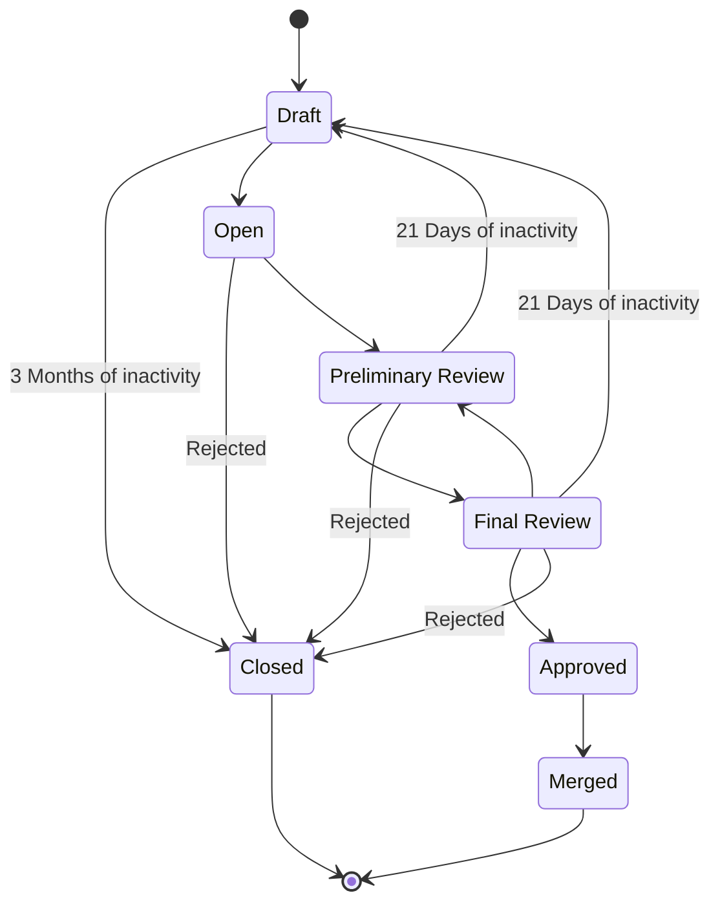

# Community Contributions Process #

This document provides a description how community contrubions are processed. Please make sure to familiarize yourself and follow the process when submitting contributions.

All community contribution pull requests will eventually get the "External Contribution" label at some point.

## The two sides of a contribution

A contribution should have **BOTH** a design document (in Jira) and a pull request (in github).

In the normal case the process usually starts with a filing a jira for the bug or the feature proposed. Then a pull request gets created to implement the feature or fix the bug. It could be the other way around too. But it's important to always have both.

There are constant efforts (including background processes) to make sure the states of the Jira and the corresponding pull request is kept in sync.

### What should go into the jira ###

The Jira is used to describe the design of the feature: why is it a good idea, what should work, what might not work etc.
Or to describe the bug: what is wrong, how to recreate it, what's the expected outcome etc.

> [!TIP]
> For faster processing always fill all of the applicable jira fields: versions affected, category, etc. 

### What should go into the pull request ###

The pull request is used to describe how the bug is fixed. Or how the feature is implemented in detail. 

A pull request should contain a **signle commit**! And that commit should have a commit message that's compliant with the MariaDB coding standards.

> [!IMPORTANT]
> Put the Jira reference, e.g. "MDEV-12345:", as a prefix to your pull request's title

> [!CAUTION]
> If there's no jira and no reference to it in your pull request there might be delays in processing it

## States of a Community Contribution ##

### Draft ###

* Pull request
  * State: Draft
  * Assignee: Not relevant
  * Label: optionally "need feedback" and/or "External Contribution"
* Jira
  * State: absent or in "Stalled"/"Open"
  * Assignee: Not relevant, keep empty

Contributions in this state are are excluded from any queues. Put your contribution in Draft mode if it's not yet ready for preliminary review. Or if you want to sketch some sort of a pull request draft to *manually* show to people. 

At any time these can be transitioned to "Open" state by clicking the "Ready for review" button in the Github pull request viewer UI.

There is a background process to move contributions in that state to "Closed" state if they have the "need feedback" and "External Contribution" pull request labels and there's been no activity for 3 months. 

### Open ##

* Pull request
  * State: Open
  * Assignee: Not relevant
  * Label: not relevant
* Jira
  * State: "Stalled" or "Open"
  * Assignee: Not relevant, keep empty

Contributions in this state should be ready for review. This means:
* There should be a single commit in the pull request and this commit must
  * have a commit message that corresponds to the MariaDB Server coding standards, including the Jira reference.
  * contain a concise description of what the change is: this goes to the git commit log and is used for reference.
  * should contain all the relevant attribution headers (co-authors, reviewers etc.)
* The pull request should contain at least a copy of the commit message. Ideally more can be added to it. 
* The pull request should target the right branch. Rule of thumb: the lowest affected activelly supported version for bugs, main branch for features and refactorings.
* All the relevant buildbot tests should be passing (or, if failing, the failures should be studied and justified as unrelated)
* The licensing of the pull request should be clear. Ideally the CLA buildbot should be green. If you can't do that mentioning a license in the pull request's description can be a workaround.

Questions and Answers
* When to move a contribution to Open state?
  * When you're ready to submit it to a preliminary review
* Who moves a contribution to Open state? 
  * Usually the submitter
* What states can the contribution be moved to? 
  * Preliminary review, when the preliminary review starts
  * Final review, if the final review starts before the preliminary
  * Closed, if rejected or has the "need feedback" pull request label and has been inactive for 3 months

  > [!Note]
  > There is an asyncronous process that assigns "External Contribution" label to pull requests in this state, if absent. This marks the contribution entering the preliminary review queue. 

### Preliminary Review ###

* Pull request
  * State: Open
  * Assignee: The primary reviewer
  * Label: External Contribution
* Jira
  * State: "Open", "In Progress", "Stalled" or "Needs feedback"
  * Assignee: The preliminary reviewer
  * Label: "Contribution"

Contributions enter this state usually from "Open" state. The primary reviewer does the following:
  * Ensures that the contribution is ready for review: has jira, tests pass, standards are followed etc.
  * Provides a best effort technical review(s) of the content. Note that the preliminary reviewer is not a domain expert, so take that review with a grain of salt. This is done to save time the final reviewer's time.
  * Follows up so that their remarks are addressed.
  * Moves the contribution to Draft if the contrubutor is inactive for 3 weeks.
  * Moves the contribution to "Final Review" when done.
  * Assigns a "contribution" label to the Jira and makes sure it has "Critical" priority. 
  * Can assign a "rework" label to community contribution pull requests. This means that reviews are done through some other process. Or that an internal developer has taken over the contribution to re-do it and push it directly. 

### Final review ###

* Pull request
  * State: Open
  * Assignee: The current final reviewer
  * Label: External Contribution
* Jira
  * State: "In progress", "In review", "In testing", "Stalled", "Needs feedback"
  * Assignee: The final reviewer (when actively reviewing) or the preliminary reviewer (when waiting for reply by the contributior for too long)
  * Label: "Contribution"

Contributions enter this state when the preliminary review is done. Or if a certain domain expert takes interest into an incoming contrubution and starts interacting with it prior to the preliminary review. The final reviewer is either a domain expert or a QA engineer. There can be more than one final reviewers assigned: usually done for more complex contributions or when quality assurance is required. 

Watch the jira state and the assignees in this state for detailed information:
  * "In review" means that somebody is assigned to review and they are working on it
  * "Stalled" means that they're waiting on something
  * "In testing" means a QA engineer is assigned and they are working on testing this.
  * "Needs feedback" means that the reviewer needs feedback to proceed
  * "In progress" means that the reviewer waited for reply by the submitter for some time and have (temporarily) moved on by moving the Jira to "In progress" and assigning it back to the preliminary reviewer. When a reply is received the preliminary reviewer will move the jira back to "In review" or "In testing" and re-assign to the final reviewer that has requested the feedback. **Try to avoid getting into that loop by being active!**

Note that there's a requirement that certain contributions need to undergo a quality assurance review. This is usally done for the new features or for more complex and risky bug fixes. If that's the desired state, a QA engineer will be assigned as a final reviewer. 

> [!TIP]
> The final reviewer is usually a very busy person! Contributors should make sure to be quick to reply to their questions to keep the process rolling. And should be patient about their replies. They are doing their best to process it as fast as possible.

### Approved ###

* Pull request
  * State: Open
  * Assignee: The last final reviewer
  * Label: External Contribution
* Jira
  * State: "Approved"
  * Assignee: The last final reviewer
  * Label: "Contribution"

Contributions in that state are ready to be merged. Usually it's the last final reviewer's job to trigger the merge of the pull request and update the Jira accordingly. But sometimes the preliminary reviewer can help with that too. 

Prior to merging the pull request it should be rebased to the latest in the target branch. Thus the contributor should be watching for any possbile merge conflicts or test failures during that rebase. The person that does the merge might need some assitance by the contributor.

When the pull request is successfully merged the Jira should be moved to closed state and its target version should be specified.

### Merged ###

* Pull request
  * State: Merged
  * Assignee: not applicable
  * Label: External Contribution
* Jira
  * State: "Closed"
  * Assignee: not applicable
  * Label: "Contribution"

This is the "success" final state for a contribution. Ideally all contributions will end up in this state. 
No further actions are necessary.

### Closed ###

* Pull request
  * State: Closed
  * Assignee: not applicable
  * Label: eventually "need feedback"
* Jira
  * State: "Closed"
  * Assignee: not applicable

This is the "failure" final state for a contribution. A contribution can land in this state for one of the following reasons:
* It was rejected by the reviewers
* It was retracted by the contributor
* It was closed due to contributor's inactivity or lack of replies to questions (as signified by the presence of the "need feedback" label into the pull request)
