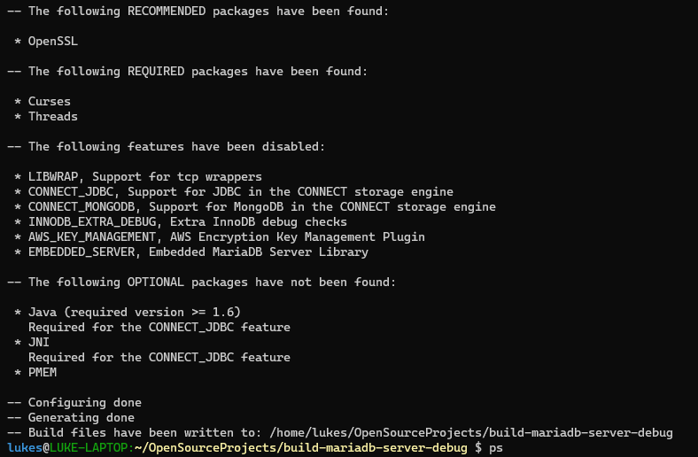
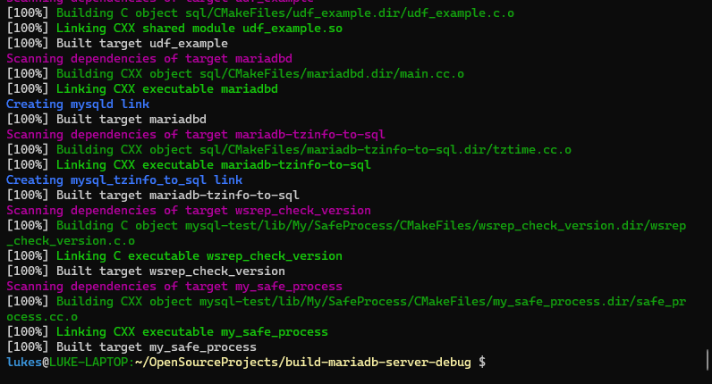

How-To Guide for Beginners: Build Source Code on a WSL Ubuntu System
----------
This is a how-to-article that walks a user that has Ubuntu installed through WSL, through the build process of MariaDB source code.    
## WSL Set-up
Make sure that you have WSL installed, see this link for installation instructions [Install WSL](https://learn.microsoft.com/en-us/windows/wsl/install)

## Fork the MariaDB Server Repository
First fork the MariaDB repository from the mariadb github repository, [Maria Server Github](https://github.com/MariaDB/server)

## Clone the Forked Server Repository to Your Local Computer

```
git clone https://github.com/MariaDB/server.git
```
## Get Build Appropriate Build Dependencies

The current intallation guide recommends using the apt build-dep mariadb-server command on Ubuntu, however, this Ubuntu package is not currently available.  

To get close to the build dependencies needed mirror a build dependencies of the most recent mariadb release, see [Repository Configuration Tool](https://mariadb.com/kb/en/building-mariadb-on-ubuntu/)

## Install Cmake
Install cmake which will be used to configure and compile the Mariadb Source code. 
```
apt install cmake
```

## Make a Build Directory
Make a build directory outside of the cloned server directory and change into this build directory.  
```
mkdir build-mariadb-server-debug
cd build-mariadb-server-debug
```
## Run the Cmake for Configuration
Within the build directory run the following command.  
```
cmake ../server -DCMAKE_BUILD_TYPE=Debug
```
This will configure the build files and check for the appropriate dependencies.  

Note: If you are lacking any required dependencies then install them using the appropriate command.  

A successful output will look like this: 


## Compile Your Source Code
Now compile the source code using the make command within the build directory that you created.  
```
make
```
After a successful build you should see something like the following: 


