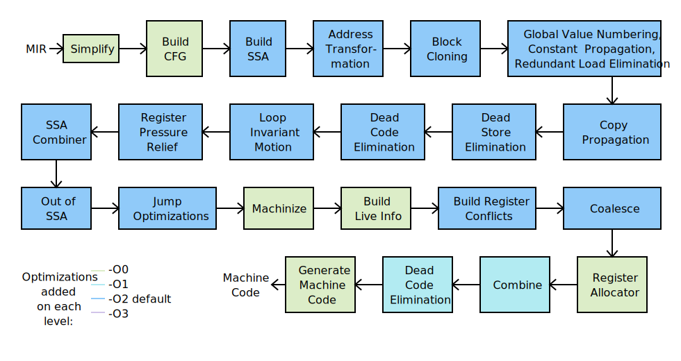

<p>
<a href="https://github.com/vnmakarov/mir/actions?query=workflow%3AAMD64%2DLinux%2DOSX%2DWindows%2Dtest"></a>
<a href="https://github.com/vnmakarov/mir/actions?query=workflow%3Aapple%2Daarch64%2Dtest"></a>
<a href="https://github.com/vnmakarov/mir/actions?query=workflow%3Aaarch64%2Dtest"></a>
<a href="https://github.com/vnmakarov/mir/actions?query=workflow%3Appc64le%2Dtest"></a>
<a href="https://github.com/vnmakarov/mir/actions?query=workflow%3As390x%2Dtest"></a>
<a href="https://github.com/vnmakarov/mir/actions?query=workflow%3Ariscv64%2Dtest"></a>
<a href="https://github.com/vnmakarov/mir/actions?query=workflow%3AAMD64%2DLinux%2Dbench"></a>
</p>

# MIR Project
  * MIR means **M**edium **I**nternal **R**epresentation
  * MIR project goal is to provide a basis to implement fast and lightweight JITs
  * Plans to try MIR light-weight JIT first for CRuby or/and MRuby implementation
  * Motivations for the project can be found in [this blog post](https://developers.redhat.com/blog/2020/01/20/mir-a-lightweight-jit-compiler-project)
  * C2MIR compiler description can be found in [this blog post](https://developers.redhat.com/blog/2021/04/27/the-mir-c-interpreter-and-just-in-time-jit-compiler)
  * Future of code specialization in MIR for dynamic language JITs can be found in [this blog post](https://developers.redhat.com/articles/2022/02/16/code-specialization-mir-lightweight-jit-compiler)

## Disclaimer
   * **There is absolutely no warranty that the code will work for any tests except ones given here and on platforms
     other than x86_64 Linux/OSX, aarch64 Linux/OSX(Apple M1), and ppc64le/s390x/riscv64 Linux**

## MIR
  * MIR is strongly typed IR
  * MIR can represent machine 32-bit and 64-bit insns of different architectures
  * [MIR.md](https://github.com/vnmakarov/mir/blob/master/MIR.md) contains detail description of MIR and its API.
    Here is a brief MIR description:
  * MIR consists of **modules**
    * Each module can contain **functions** and some declarations and data
    * Each function has **signature** (parameters and return types), **local variables**
      (including function arguments) and **instructions**
      * Each local variable has **type** which can be only 64-bit integer, float, double, or long double
        and can be bound to a particular target machine register
      * Each instruction has **opcode** and **operands**
        * Operand can be a local variable
	  (or a function argument), **immediate**, **memory**, **label**, or **reference**
          * Immediate operand can be 64-bit integer, float, double, or long double value
	  * Memory operand has a **type**, **displacement**, **base** and **index** integer local variable,
	    and integer constant as a **scale** for the index
	    * Memory type can be 8-, 16-, 32- and 64-bit signed or unsigned integer type,
	      float type, double, or long double type
	      * When integer memory value is used it is expanded with sign or zero promoting
	        to 64-bit integer value first
	  * Label operand has name and used for control flow instructions
	  * Reference operand is used to refer to functions and declarations in the current module,
	    in other MIR modules, or for C external functions or declarations
	* opcode describes what the instruction does
	* There are **conversion instructions** for conversion between different
	  32- and 64-bit signed and unsigned values, float, double, and long double values
	* There are **arithmetic instructions** (addition, subtraction, multiplication, division,
	  modulo) working on 32- and 64-bit signed and unsigned values, float, double, and long double values
	* There are **logical instructions** (and, or, xor, different shifts) working on
	  32- and 64-bit signed and unsigned values
	* There are **comparison instructions**  working on 32- and 64-bit
	  signed and unsigned values, float, double, and long double values
	* There are **local variable address instructions** to get address of local variable
	* There are **branch insns** (unconditional jump, and jump on zero or non-zero value)
	  which take a label as one their operand
	* There are **combined comparison and branch instructions** taking a label as one operand
	  and two 32- and 64-bit signed and unsigned values, float, double, and long double values
	* There is **switch** instruction to jump to a label from labels given as operands
	  depending on index given as the first operand
	* There is **label address instruction** to get a label address
	  and **unconditional indirect jump instruction** whose operand contains previously taken label address
	* There are **function and procedural call instructions**
	* There are **return instructions** optionally returning 32- and 64-bit
	  integer values, float, double, and long double values
	* There are **specialized light-weight call and return instructions** can be used for
	  fast switching from threaded interpreter to JITted code and vice verse
	* There are **property** instructions to generated specialized machine code when lazy basic block versioning is used

## MIR Example
  * You can create MIR through **API** consisting of functions for creation of modules,
    functions, instructions, operands etc
  * You can also create MIR from MIR **binary** or **text** file
  * The best way to get a feel about MIR is to use textual MIR representation
  * Example of Eratosthenes sieve on C
```c
#define Size 819000
int sieve (int N) {
  int64_t i, k, prime, count, n; char flags[Size];

  for (n = 0; n < N; n++) {
    count = 0;
    for (i = 0; i < Size; i++)
      flags[i] = 1;
    for (i = 0; i < Size; i++)
      if (flags[i]) {
        prime = i + i + 3;
        for (k = i + prime; k < Size; k += prime)
          flags[k] = 0;
        count++;
      }
  }
  return count;
}
void ex100 (void) {
  printf ("sieve (100) = %d\", sieve (100));
}
```
  * Example of MIR textual file for the same function:
```mir
m_sieve:  module
          export sieve
sieve:    func i32, i32:N
          local i64:iter, i64:count, i64:i, i64:k, i64:prime, i64:temp, i64:flags
          alloca flags, 819000
          mov iter, 0
loop:     bge fin, iter, N
          mov count, 0;  mov i, 0
loop2:    bge fin2, i, 819000
          mov u8:(flags, i), 1;  add i, i, 1
          jmp loop2
fin2:     mov i, 0
loop3:    bge fin3, i, 819000
          beq cont3, u8:(flags,i), 0
          add temp, i, i;  add prime, temp, 3;  add k, i, prime
loop4:    bge fin4, k, 819000
          mov u8:(flags, k), 0;  add k, k, prime
          jmp loop4
fin4:     add count, count, 1
cont3:    add i, i, 1
          jmp loop3
fin3:     add iter, iter, 1
          jmp loop
fin:      ret count
          endfunc
          endmodule
m_ex100:  module
format:   string "sieve (10) = %d\n"
p_printf: proto p:fmt, i32:result
p_sieve:  proto i32, i32:iter
          export ex100
          import sieve, printf
ex100:    func v, 0
          local i64:r
          call p_sieve, sieve, r, 100
          call p_printf, printf, format, r
          endfunc
          endmodule
```

  * `func` describes signature of the function (taking 32-bit signed
    integer argument and returning 32-bit signed integer value)
    and function argument `N` which will be local
    variable of 64-bit signed integer type
    * Function results are described first by their types and have no names.
      Parameters always have names and go after the result description
    * Function may have more than one result but possible number and combination
      of result types are currently machine defined
  * You can write several instructions on one line if you separate them by `;`
  * The instruction result, if any, is always the first operand
  * We use 64-bit instructions in calculations
  * We could use 32-bit instructions in calculations which would have sense if we use 32-bit CPU
    * When we use 32-bit instructions we take only 32-bit significant part of 64-bit operand
      and high 32-bit part of the result is machine defined (so if you write a portable MIR code
      consider the high 32-bit part value is undefined)
  * `string` describes data in form of C string
     * C string can be used directly as an insn operand.  In this case the data will be added
       to the module and the data address will be used as an operand
  * `export` describes the module functions or data which are visible outside the current module
  * `import` describes the module functions or data which should be defined in other MIR modules
  * `proto` describes function prototypes.  Its syntax is the same as `func` syntax
  * `call` are MIR instruction to call functions

## Running MIR code
  * After creating MIR modules (through MIR API or reading MIR binary or textual files),
    you should load the modules
    * Loading modules makes visible exported module functions and data
    * You can load external C function with `MIR_load_external`
  * After loading modules, you should link the loaded modules
    * Linking modules resolves imported module references, initializes data,
      and set up call interfaces
  * After linking, you can interpret functions from the modules or call machine code
    for the functions generated with MIR JIT compiler (generator).  What way the function can be executed
    is usually defined by set up interface.  How the generated code is produced (lazily on the first call or ahead of time)
    can be also dependent on the interface
  * Running code from the above example could look like the following (here `m1` and `m2` are modules
    `m_sieve` and `m_e100`, `func` is function `ex100`, `sieve` is function `sieve`):
```c
    /* ctx is a context created by MIR_init / MIR_init2 */
    MIR_load_module (ctx, m1); MIR_load_module (ctx, m2);
    MIR_load_external (ctx, "printf", printf);
    MIR_link (ctx, MIR_set_interp_interface, import_resolver);
    /* or use MIR_set_gen_interface to generate and use the machine code */
    /* or use MIR_set_lazy_gen_interface to generate function code on its 1st call */
    /* use MIR_gen (ctx, func) to explicitly generate the function machine code */
    MIR_interp (ctx, func, &result, 0); /* zero here is arguments number  */
    /* or ((void (*) (void)) func->addr) (); to call interpr. or gen. code through the interface */
```

### Running binary MIR files on Linux through `binfmt_misc`

The `mir-bin-run` binary is prepared to be used from `binfmt_misc` with the
following line (example):

```bash
line=:mir:M::MIR::/usr/local/bin/mir-bin-run:P
echo $line > /proc/sys/fs/binfmt_misc/register
```

> Do adapt the mir-bin-run binary path to your system, that is the default one

And run with
```bash
c2m your-file.c -o your-file
chmod +x your-file
./your-file your args
```

The executable is "configurable" with environment variables:

* `MIR_TYPE` sets the interface for code execution: `interp` (for interpretation),
  `jit` (for generation) and `lazy` (for lazy generation, default);
* `MIR_LIBS` (colon separated list) defines a list of extra libraries to load;
* `MIR_LIB_DIRS` or `LD_LIBRARY_PATH` (colon separated list) defines an extra list
  of directories to search the libraries on.


> Due to the tied nature of `mir-bin-run` with `binfmt_misc`, it may be a bit weird
> to call `mir-bin-run` directly.
> The `P` flag on the binfmt_misc passes an extra argument with the full path
> to the MIR binary.

## The current state of MIR project

  

  * You can use C **setjmp/longjmp** functions to implement **longjump** in MIR
  * Binary MIR code is usually upto **10 times more compact** and upto **10 times faster to read**
    than analogous MIR textual code
  * MIR interpreter is about 6-10 times slower than code generated by MIR JIT compiler
  * LLVM IR to MIR translator has not been finished and probably will be never fully implemented
    as LLVM IR is much richer than MIR but translation of LLVM IR generated from standard C/C++ to MIR
    is a doable task

## The possible future state of MIR project
  

  * WASM to MIR translation should be pretty straightforward
    * Only small WASM runtime for WASM floating point round insns needed to be provided for MIR
  * Porting GCC to MIR is possible too.  An experienced GCC developer can implement this
    for 6 to 12 months
  * On my estimation porting MIR JIT compiler to mips64 or sparc64 will take
    1-2 months of work for each target
  * Performance minded porting MIR JIT compiler to 32-bit targets will need an implementation of
    additional small analysis pass to get info what 64-bit variables are used only
    in 32-bit instructions

## MIR JIT compiler
  * Very short optimization pipeline for speed and light-weight
  * Only the **most valuable** optimization usage:
    * **function inlining**
    * **global common sub-expression elimination**
    * **variable renaming**
    * **register pressure sensitive loop invariant code motion**
    * **conditional constant propagation**
    * **dead code elimination**
    * **code selection**
    * fast **register allocator** with
      * aggressive coalescing registers and stack slots for copy elimination
      * live range splitting
  * Different optimization levels to tune compilation speed vs generated code performance
  * **SSA** form of MIR is used before register allocation
    * We use a form of Braun's algorithm to build SSA (M. Braun et al. "Simple and Efficient
      Construction of Static Single Assignment Form")
  * Simplicity of optimizations implementation over extreme generated code performance

  * More details about **full JIT compiler pipeline**:

  * **Simplify**: lowering MIR
  * **Inline**: inlining MIR calls
  * **Build CFG**: building Control Flow Graph (basic blocks and CFG edges)
  * **Build SSA**: Building Single Static Assignment Form by adding phi nodes and SSA edges to operands
  * **Address Transformation**: remove or change MIR ADDR instructions
  * **Global Value Numbering**: removing redundant insns through GVN.  This includes constant
    propagation and redundant load eliminations
  * **Copy Propagation**: SSA copy propagation and removing redundant extension instructions
  * **Dead store elimination**: removing redundant stores
  * **Dead Code Elimination**: removing insns with unused outputs
  * **Pressure relief**: moving insns to decrease register pressure
  * **SSA combine**: combining addresses and compare and branch instruction pairs
  * **Out of SSA**: Removing phi nodes and SSA edges
  * **Jump opts**: Different jump optimizations
  * **Machinize**: run machine-dependent code transforming MIR for calls ABI, 2-op insns, etc
  * **Find Loops**: finding natural loops and building loop tree
  * **Build Live Info**: calculating live in and live out for the basic blocks
  * **Build Register Conflicts**: building conflict matrix for registers involved in moves.
    It is used for register coalescing
  * **Coalesce**: aggressive register coalescing
  * **Register Allocator (RA)**: priority-based linear scan RA with live range splitting
  * **Build Live Ranges**: calculating program point ranges for registers
  * **Assign**: fast RA for `-O0` or priority-based linear scan RA for `-O1` and above
  * **Rewrite**: transform MIR according to the assign using reserved hard regs
  * **Combine** (code selection): merging data-depended insns into one
  * **Dead Code Elimination**: removing insns with unused outputs
  * **Generate Machine Insns**: run machine-dependent code creating machine insns

## C to MIR translation
  * We implemented a small C11 (2011 ANSI C standard with some GCC extensions) to MIR compiler `c2m`.
    See [README.md](https://github.com/vnmakarov/mir/tree/master/c2mir)
  * C code can be used as an input of JIT compiler besides MIR
    * Usage of C as an input to JIT compiler can slow down compilation speed up to 2 times

## Structure of the project code
 * Files `mir.h` and `mir.c` contain major API code including input/output of MIR binary
   and MIR text representation
 * Files `mir-dlist.h`, `mir-mp.h`, `mir-varr.h`, `mir-bitmap.h`, `mir-hash.h`, `mir-htab.h`, `mir-reduce.h`
   contain generic code  correspondingly for double-linked lists, memory pools, variable length arrays, bitmaps,
   hash calculations, hash tables, and compressing/decompressing data.  File `mir-hash.h` is a general, simple,
   high quality hash function used by hashtables
 * File `mir-interp.c` contains code for interpretation of MIR code.  It is included in `mir.c`
   and never compiled separately
 * Files `mir-gen.h`, `mir-gen.c`, `mir-gen-x86_64.c`, `mir-gen-aarch64.c`, `mir-gen-ppc64.c`, `mir-gen-s390x.c`,
   and `mir-gen-riscv64.c` contain code for MIR JIT compiler
   * Files `mir-gen-x86_64.c`, `mir-gen-aarch64.c`, `mir-gen-ppc64.c`, `mir-gen-s390x.c`,
   and `mir-gen-riscv64.c` is machine dependent code of JIT compiler
 * Files `mir-<target>.c` contain simple machine dependent code common for interpreter and
   JIT compiler
 * Files `mir-<target>.h` contain declarations common for interpreter and JIT compiler
 * Files `mir2c/mir2c.h` and `mir2c/mir2c.c` contain code for MIR to C compiler.  The generated code might be not portable
 * Files `c2mir/c2mir.h`, `c2mir/c2mir.c`, `c2mir/c2mir-driver.c`, and `c2mir/mirc.h` contain code for
   C to MIR compiler.  Files in directories `c2mir/x86_64` and `c2mir/aarch64`, `c2mir/ppc64`, `c2mir/s390x`,
   and `c2mir/riscv64` contain correspondingly x86_64, aarch64, ppc64le, s390x, and riscv machine-dependent
   code for C to MIR compiler
 * File `mir-bin-run.c` contains code for `mir-bin-run` described above
 * File `mir-bin-driver.c` with `b2ctab` utility can be used for portable way to generate binary from MIR binary files
 * Directory `mir-utils` contains different utilities to work with MIR,
   e.g. transforming binary MIR to textual MIR and vice verse
 * Directory `adt-tests`, `mir-tests`, `c-tests`, and `c-benchmarks` contains code for testing and benchmarking MIR and `c2m`

## Playing with current MIR project code
  * You can run some benchmarks and tests by `make bench` and `make test`

## Current MIR Performance Data

  * Intel i5-13600K with 64GB memory under FC37 with GCC-12.3.1

    |                | MIR-generator   | MIR-interpreter |     gcc -O2      |     gcc -O0     |
    |----------------|-----------------|-----------------|------------------|-----------------|
    | compilation [1]| **1.0** (249us) | 0.09 (22us)     | **109** (27.1ms) |  105 (26.1ms)   |
    | execution [2]  | **1.0** (1.74s) | 13.7 (23.8s)    | **0.92** (1.6s)  |  2.28 (3.97s)   |
    | code size [3]  | **1.0** (557KB) | 0.43 (240KB)    | **58** (32.2MB)  |  58 (32.2MB)    |
    | LOC [4]        | **1.0** (23.4K) | 0.48 (11.3K)    | **103** (2420K)  | 103  (2402K)    |

   [1] is based on wall time of compilation of C sieve code (w/o any include file and with
   using memory file system for GCC) and the corresponding MIR sieve code by MIR-interpreter
   and MIR-generator with optimization level 2

   [2] is based on the best wall time of 10 runs with used MIR-generator optimization level 2

   [3] is based on stripped sizes of cc1 for GCC and MIR core and interpreter or generator for MIR

   [4] my estimation based only on files required for x86-64 GNU C compiler and MIR files for minimal program to create
   and run MIR code

## Current C2MIR Performance Data

  * Intel i5-13600K with 64GB memory under FC37 with GCC-12.3.1

    |                | c2m -O2 -eg (generator) | c2m -ei (interpreter) |     gcc -O2      |     gcc -O0     |
    |----------------|-------------------------|-----------------------|------------------|-----------------|
    | compilation [1]| **1.0** (336us)         | 1.0 (337us)           | **80** (27.1ms)  |  77 (26.1ms)    |
    | execution [2]  | **1.0** (1.74s)         | 13.7 (23.8s)          | **0.92** (1.6s)  |  2.28 (3.97s)   |
    | code size [3]  | **1.0** (961KB)         | 1.0 (961KB)           | **34** (32.2MB)  |  34 (32.2MB)    |
    | LOC [4]        | **1.0** (54.8K)         | 1.0 (54.8K)           | **44** (2420K)   |  44  (2420K)    |

   [1] is based on wall time of compilation of C sieve code (w/o any include file and with
   using memory file system for GCC)

   [2] is based on the best wall time of 10 runs with used MIR-generator optimization level 2

   [3] is based on stripped sizes of cc1 for GCC and C2MIR, MIR core, interpreter, and generator for MIR

   [4] is based on all source files excluding tests

  * Here is generated code performance related to GCC -O2 for different C compilers on 15 small C benchmarks (from directory `c-benchmarks`) on the same machine where
    * gcc version is 12.3.1
    * clang version is 15.0.7
    * [chibicc](https://github.com/rui314/chibicc) is Rui Ueyama's latest C11 implementation
    * [cparser](https://github.com/libfirm/cparser) is a C99 implementation based on a pretty sophisticated backend, libFirm version 1.22
    * [cproc](https://github.com/michaelforney/cproc) is Michael Forney's C11 implementation based on the **QBE** compiler backend
    * [lacc](https://github.com/larmel/lacc) is a C89 implementation
    * [pcc](http://pcc.ludd.ltu.se) (1.2.0.DEVEL) is a modern version of the Portable C compiler
    * [tcc](https://bellard.org/tcc/) (0.9.27) is the tiny C11 compiler
    * emcc (2.0.20) is emscripten compiler to Webassembly with wasmer (1.0.2) runtime
    * wasi cranelift is a C to webassember clang compiler (11.0.0) with wasmer (1.0.2) based on cranelift backend
    * wasi LLVM is a C to webassember clang compiler (11.0.0) with wasmer (1.0.2) based on LLVM backend
    * wasi singlepass is a C to webassember clang compiler (11.0.0) with wasmer (1.0.2) based on singlepass backend
    * wasi wasmtime is a C to webassember clang compiler (11.0.0) with wasmtime (0.26.0) runtime based on cranelift backend

    |                                                  |  Average  |   Geomean |
    |--------------------------------------------------|-----------|-----------|
    | gcc -O2                                          |    1.00   |   1.00    |
    | gcc -O0                                          |    0.63   |   0.57    |
    | **c2m -eg**                                      |  **0.96** | **0.91**  |
    | c2m -eb                                          |    0.92   |   0.85    |
    | chibicc                                          |    0.38   |   0.30    |
    | clang -O2                                        |    1.12   |   1.09    |
    | cparser -O3                                      |    1.02   |   0.98    |
    | cproc                                            |    0.68   |   0.65    |
    | lacc -O3                                         |    0.47   |   0.39    |
    | pcc -O                                           |    0.80   |   0.78    |
    | tcc                                              |    0.54   |   0.50    |
    | emcc -O2/wasmer                                  |    0.60   |   0.55    |
    | wasi -O2/wasmer cranelift                        |    0.60   |   0.54    |
    | wasi -O2/wasmer LLVM                             |    0.78   |   0.72    |
    | wasi -O2/wasmer singlepass                       |    0.45   |   0.36    |
    | wasi -O2/wasmtime                                |    0.92   |   0.87    |

## MIR project competitors
  * I only see three projects which could be considered or adapted as real universal light-weight JIT competitors
  * [**QBE**](https://c9x.me/compile/):
    * It is small (10K C lines)
    * It uses SSA based IR (kind of simplified LLVM IR)
    * It has the same optimizations as MIR-generator plus aliasing but QBE has no inlining
    * It generates assembler code which makes QBE 30 slower in machine code generation than MIR-generator
    * On my benchmarks it generates code whose geomean performance is only 65% of GCC with -O2
      (performance of MIR generated code is 91% of GCC with -O2) while having the same compilation speed as MIR
  * [**LIBJIT**](https://www.gnu.org/software/libjit/) started as a part of DotGNU Project:
    * LIBJIT is bigger:
      * 80K C lines (for LIBJIT w/o dynamic Pascal compiler) vs 20K C lines for MIR
        (excluding C to MIR compiler)
    * LIBJIT has fewer optimizations: only copy propagation and register allocation
  * [**RyuJIT**](https://github.com/dotnet/runtime/blob/main/docs/design/coreclr/jit/ryujit-overview.md)
    is a part of runtime for .NET Core:
    * RyuJIT is even bigger: 360K SLOC
    * RyuJIT optimizations is basically MIR-generator optimizations
    * RyuJIT uses SSA
  * Other candidates:
    * [**LIBFirm**](https://github.com/libfirm/libfirm): less standalone-, big- (140K LOC), SSA,
      ASM generation-, LGPL2
    * [**CraneLift**](https://github.com/CraneStation/cranelift): less standalone-,
      big- (70K LOC of Rust-), SSA, Apache License
    * [**NanoJIT**](https://github.com/dibyendumajumdar/nanojit), standalone+, medium (40K C++ LOC), only simple RA-,
      Mozilla Public License

## Porting MIR
  * Currently MIR works on x86_64, aarch64, ppc64le, s390x, riscv64 Linux and x86_64/aarch64 (Apple M1) MacOS
  * [HOW-TO-PORT-MIR.md](https://github.com/vnmakarov/mir/blob/master/HOW-TO-PORT-MIR.md) outlines process of porting MIR
    * On my estimation an experienced developer can port MIR (including `c2m`) to another target for 1-2 months
