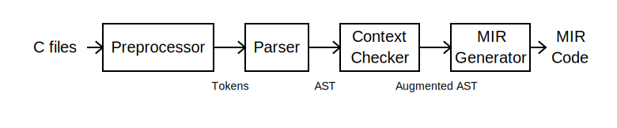

# C to MIR compiler
  * Implementation of a small C11 (2011 ANSI C standard) to MIR compiler
    * no optional standard features: variable size arrays, complex, atomic, thread local variables
    * support of the following C extensions (many of them can be used for better
      JIT implementation of dynamic programming languages):
      * `\e` escape sequence
      * binary numbers starting with `0b` or `0B` prefix
      * macro `__has_include`
      * empty structure, unions, and initializer list
      * range cases `case <start>...<finish>`
      * zero size arrays
      * statement expressions
      * labels as values (see analogous GNU C extension)
      * register variables (see analogous global register variable extension in GNU C)
      * builtins (some of them is a part GNU C extensions):
        * `__builtin_expect(<cond>, <expected cond value>)` is used instead of <cond>
	  to hint `c2mir` about expected value and results in better code generation
	  by placing code related to the expected condition nearby
        * overflow builtins can be used for effective code generation in JIT for interpreters
	  using multi-precision integer numbers like Ruby or Python:
          * `__builtin_add_overflow(v1,v2,&res)` makes `res=v1+v2` and returns non-zero
	    if the overflow occurs
	  * `__builtin_sub_overflow(v1,v2,&res)` and `__builtin_mul_overflow(v1,v2,&res)` are
	    analogous to the above builtin but makes subtraction and multiplication
        * builtins for jump calls and returns can be used for fast switching between JITted code
	  and threaded code interpreters:
	  * `__builtin_jcall(func)` calls the C function with void result through a direct jump.
	    Such function should return by the next builtin only
	  * `__builtin_jret (addr)` returns from a function called by `__builtin_jcall` to given address
        * builtins used for generating specialized code based on lazy basic block versioning
	  (see [blogpost](https://developers.redhat.com/articles/2022/02/16/code-specialization-mir-lightweight-jit-compiler#)
	  how to use them):
	  * `__builtin_prop_set(var, property_const)` sets the variable property to given constant
	  * `__builtin_prop_eq(var, property_const)` and `__builtin_prop_eq(var, property_const)` compares
	    current property value of the variable with given constant and returns true
	    if they are correspondingly equal or not equal
  * Minimal compiler code dependency.  No additional tools (like yacc/flex) are used
  * Simplicity of implementation over speed to make code easy to learn and maintain
    * Four passes to divide compilation on manageable sub-tasks:
      1. Preprocessor pass generating tokens
      2. Parsing pass generating AST (Abstract Syntax Tree). To be close ANSI standard grammar
         as soon as possible, [**PEG**](https://en.wikipedia.org/wiki/Parsing_expression_grammar)
         manual parser is used
      3. Context pass checking context constraints and augmenting AST
      4. Generation pass producing MIR

  

  C to MIR compiler can be used as a library to make it as a part of
  your code.  The compiler can be used as a separate program as usual C
  compiler.

  To recognize compilation by C-to-MIR compiler, compiler specific
  macros `__mirc__` and `__MIRC__` defined as 1 can be used.

  An additional information about C-to-MIR compiler can be found in
  [this blog post](https://developers.redhat.com/blog/2021/04/27/the-mir-c-interpreter-and-just-in-time-jit-compiler)
  
## C to MIR compiler as usual C compiler
  The project makefile builds program `c2m` which can compile C and
  MIR files given on the command line and produce MIR code or execute
  it:
  * The compiler `c2m` has options `-E`, `-c`, `-S`, and `-o` as other C compilers:
    * `-E` stops the compiler after preprocessing and output the
      preprocessed file into standard output or into file given after
      option `-o`
    * `-S` stops the compiler after generation of MIR code and outputs
      MIR *textual* representations of C source files and binary MIR files
      with suffix `.bmir`
    * `-c` also stops the compiler after generation of MIR code and
      outputs MIR *binary* representation of C source files and textual
      MIR files with suffix `.mir`
    * Output files for options `-S` and `-c` are created in the
      current directory named as the source files by using suffix
      correspondingly `.mir` and `.bmir`
    * If you have one source file, you also can use option `-o` to setup the output file
  * You can give C source on the command line by using option `-s` and
    subsequent string which will be C source
  * You can read C source from the standard input by using option `-i`
  * If options `-E`, `-c`, or `-S` are not given, all generated MIR
    code is linked and checked that there is function `main`.  The
    whole generated code is output as binary MIR file `a.bmir` or as
    file given by option `-o`
  * Instead of output of the linked file, you can execute the program by using options `-ei`, `-eg`, `-el`, or `-eb`:
    * `-ei` means execution the code by MIR interpreter
    * `-eg` means execution machine code generated by
      MIR-generator. MIR-generator processing all MIR code first
      before the interpreter
    * `-el` means lazy code generation. It is analogous to `-eg` but
      function code is generated on the first call of the function.
      So machine code will be never generated for functions never used
    * `-eb` means lazy BB code generation. It is analogous to `-el` but
      BB code is generated on the first execution of the BB
    * Command line arguments after option `-ei`, `-eg`, `-el`, or `-eb` are
      not processed by C to MIR compiler. Such arguments are passed to
      generated and executed MIR program
    * The executed program can use functions from libraries `libc` and `libm`.  They are always available
      * Option `-lxxx` makes library `libxxx` available for the program execution
      * Option `-Lxxx` adds library directory `xxx` to search libraries given by options `-lxxx`.  The search
        starts with the standard library directory and continues in directories
	given by preceding `-L` options in their order on the command line
    * To generate stand-alone executable see utility `b2ctab` description in directory `mir-utils`
  * Options `-D` and `-U` are analogous to ones used in other C
    compilers for macro manipulations on the command line
  * Option `-I` to add include directory is analogous to other C-compilers
  * Option `-fpreprocessed` means skipping preprocessor for C files
  * Option `-fsyntax-only` means stopping after parsing and semantic
    checking of C files without MIR code generation
  * Option `-w` means switching off reporting all warnings
  * Option `-pedantic` is used for stricter diagnostic about C
    standard conformance.  It might be useful as C2MIR implements some GCC extensions of C
  * Option `-O<n>` is used to set up MIR-generator optimization level.  The optimization levels are described
    in documentation for MIR generator API function `MIR_gen_set_optimize_level`
  * Option `-dg[<level>]` is used for debugging MIR-generator.  It results in dumping debug information
    about MIR-generator work to `stderr` according to the debug level.  If the level is omitted,
    it means maximal level
  * Besides C files, MIR textual files with suffix `.mir` and MIR
    binary files with suffix `.bmir` can be given on the command line.
    In this case these MIR files are read and added to generated MIR code
  * Simple examples of the compiler usage and execution of C program:
```
	c2m -c part1.c && c2m -S part2.c && c2m part1.bmir part2.mir -eg # variant 1
	c2m part1.c part2.c && c2m a.bmir -eg                            # variant 2
	c2m part1.c part2.c -eg                                          # variant 3
```

## C to MIR compiler as a library
  The compiler can be used as a library and can be made a part of your
  program.  It can take C code from a file or memory. The all compiler
  code is contained in file `c2mir.c`. Its interface is described in
  file `c2mir.h`:
  * Function `c2mir_init (MIR_context ctx)` initializes the compiler to generate MIR code in context `ctx`
  * Function `c2mir_finish (MIR_context ctx)` finishes the compiler to
    work in context `ctx`.  It frees some common memory used by the compiler
    worked in context `ctx`
  * Function `c2mir_compile (MIR_context_t ctx, struct c2mir_options *ops, int (*getc_func) (void *),
                             void *getc_data, const char *source_name, FILE *output_file)`
    compiles one C code file.  Function returns true (non-zero) in case of
    successful compilation. It frees all memory used to compile the
    file.  So you can compile a lot of files in the same context
    without program memory growth.  Function `getc_func` provides
    access to the compiled C code which can be
    in a file or memory.  The function will get `getc_data` every its call as its argument.
    Name of the source file used for diagnostic
    is given by parameter `source_name`.  Parameter `output_file` is
    analogous to one given by option `-o` of `c2m`.  Parameter ops is
    a pointer to a structure defining the compiler options:
    * Member `message_file` defines where to report errors and
      warnings.  If its value is NULL, there will be no any output
    * Members `macro_commands_num` and `macro_commands` direct compiler as options `-D` and `-U` of `c2m`
    * Members `include_dirs_num` and `include_dirs` direct compiler as options `-I`
    * Members `debug_p`, `verbose_p`, `ignore_warnings_p`, `no_prepro_p`, `prepro_only_p`,
      `syntax_only_p`, `pedantic_p`, `asm_p`, and `object_p` direct
      the compiler as options `-d`, `-v`, `-w`, `-fpreprocessed`, `-E`,
      `-fsyntax-only`, `-pedantic`, `-S`, and `-c` of `c2m`.  If all values of `prepro_only_p`,
      `syntax_only_p`, `asm_p`, and `object_p are zero, there will be no output files, only
      the generated MIR module will be kept in memory of the context `ctx`
    * Member `module_num` defines index in the generated MIR module name (if there is any)
